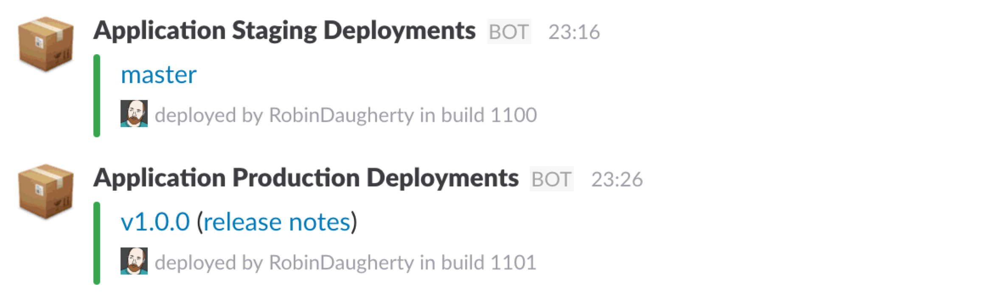
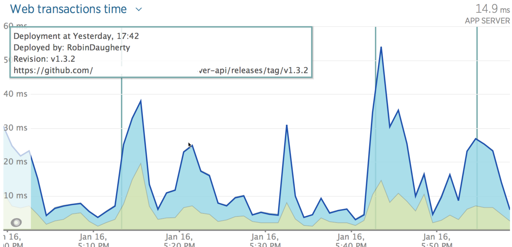

[](https://travis-ci.org/RobinDaugherty/circleci_deployment_notifier)
[](https://www.codacy.com/app/robindaugherty/circleci_deployment_notifier?utm_source=github.com&amp;utm_medium=referral&amp;utm_content=RobinDaugherty/circleci_deployment_notifier&amp;utm_campaign=Badge_Grade)
[](https://www.codacy.com/app/robindaugherty/circleci_deployment_notifier?utm_source=github.com&utm_medium=referral&utm_content=RobinDaugherty/circleci_deployment_notifier&utm_campaign=Badge_Coverage)
[](https://gemnasium.com/github.com/RobinDaugherty/circleci_deployment_notifier)

# CircleCI Deployment Notifier

Sends deployment notifications based on deployments that occur on CircleCI.





Assumptions:

- Using CircleCI.
- Using Github.
- Using Slack for notifications and/or using New Relic.

You can also:

- Deploy releases that are tagged using Github Releases.

## Usage

Requires Ruby 2.0.0 or higher.

Add the following commands to your `circle.yml` deployment section:

```sh
gem install circleci_deployment_notifier
circleci_deployment_notify_slack -a "Application Name" -u "https://hooks.slack.com/services/WEBHOOK"
circleci_deployment_notify_new_relic -a "Application Name" --api-key "12345abcde" --app-id "12345678"
```

It's best to use environment variables for sensitive information such as Slack webhook URLs or API keys.

So here's an example `circle.yml` deployment section that 
assumes you've set the environment variables `DEPLOYMENT_SLACK_WEBHOOK_URL` and `NEW_RELIC_API_KEY`:
```yml
deployment:
  staging:
    branch: master
    commands:
    - # TODO: something to deploy the application to staging
    - gem install circleci_deployment_notifier
    - circleci_deployment_notify_slack -a "Application Staging" -u $DEPLOYMENT_SLACK_WEBHOOK_URL
    - circleci_deployment_notify_new_relic -a "Application Staging" --api-key $NEW_RELIC_API_KEY --app-id "12345678"
  production:
    tag: /v[0-9]+\.[0-9]+\.[0-9]+/
    owner: MyOrganization
    commands:
    - # TODO: something to deploy the application to production
    - gem install circleci_deployment_notifier
    - circleci_deployment_notify_slack -a "Application Production" -u $DEPLOYMENT_SLACK_WEBHOOK_URL
    - circleci_deployment_notify_new_relic -a "Application Production" --api-key $NEW_RELIC_API_KEY --app-id "87654321"
```

### Tag Deploys
That `production` section is designed to build and deploy for tags like "v1.0.0" that are created in
the fork of the repo that belongs to MyOrganization.
(So tags created in forks do not cause a build or deployment.)
See [CircleCI docs](https://circleci.com/docs/configuration/#tags) for more info.

### Slack Webhook

Create an Incoming Webhook service in Slack, and assign it the channel you want it to post.
If you want to post staging and production notifications to different Slack channels, you will need
to create different Webhooks for each.

### New Relic

To get the New Relic App ID for each application, you must first have the application running and
reporting to New Relic.
This creates the application in New Relic and it will appear in the APM area of
[rpm.newrelic.com](https://rpm.newrelic.com).

Find the application in New Relic, and get the App ID from its URL.
The URL will look like `https://rpm.newrelic.com/accounts/<your_account_number>/applications/<app_id>`

## Development

After checking out the repo, run `bin/setup` to install dependencies. Then, run `rake spec` to run the tests. You can also run `bin/console` for an interactive prompt that will allow you to experiment.

To install this gem onto your local machine, run `bundle exec rake install`. To release a new version, update the version number in `version.rb`, and then run `bundle exec rake release`, which will create a git tag for the version, push git commits and tags, and push the `.gem` file to [rubygems.org](https://rubygems.org).

## Contributing

Bug reports and pull requests are welcome on GitHub at https://github.com/RobinDaugherty/circleci_deployment_notifier.

## FAQ

### Why is this project built on Travis when it's specifically for CircleCI?

CircleCI does not support builds against multiple versions of Ruby, so for a tool like this, Travis
is a better fit.
This gem is for use by applications, where it will be built on a single version of Ruby and deployed
to staging and/or production infrastructure owned by the team.

## License

The gem is available as open source under the terms of the [MIT License](http://opensource.org/licenses/MIT).
